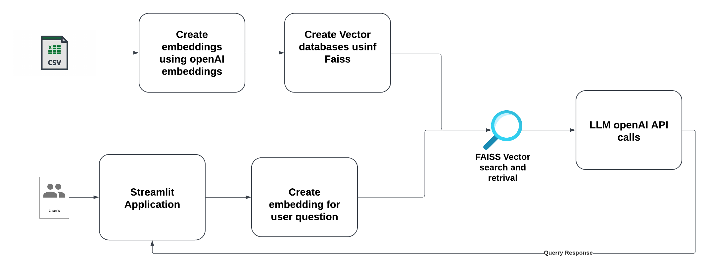

## Transforming Customer support with LLM's

# Introduction
This project focuses on solving a common challenge in customer support: managing a large number of tickets efficiently. Many businesses struggle with slow response times, incorrect prioritization, and inconsistent service quality. Traditional support systems often can't keep up as the workload grows, leading to higher costs and unhappy customers. By using Large Language Models (LLMs), this project aims to transform how support tickets are handled. LLMs can read and understand tickets, sort them by urgency and topic, and even provide accurate and helpful responses quickly, improving the overall customer experience.


**Production-ready LLM-powered customer support system with automated CI/CD pipeline, comprehensive testing, and deployment automation.**

---

# Solution Architecture 



## 🚀 Features

- **Automated Testing** with pytest and CI/CD
- **Code Quality Checks** (black, flake8, isort)
- **RAG Pipeline** with FAISS vector store
- **LLM Integration** with OpenAI
- **Streamlit Demo** for interactive testing
- **Production-Ready** with comprehensive test coverage

# Folder Structure
1. The folder `src/helper.py` contains all the modular functions needed in the project. 
2. `analysis.ipynb` notebook performs data analysis and EDA and also allows programmer to run the code. 
3. Setup the `OpenAI key` as highlighted in the code and [here](https://platform.openai.com/docs/quickstart) in the enviroment variables. Put it on line 11 in `helper.py`.
3. `demo.py` contains the streamlit demo code. To run it, go to the terminal and enter `streamlit run demo.py` and follow the instructions.
4. The folder `vector_store` contains the FAISS database of the datset which is vectorized and stored and helps in the RAG pipeline process.

# Getting Started
1. After installing the packages, setup your OpenAI key in the enviroment. `helper.py` contains function `call_llm` which calls OpenAI API.
2. Embeddings are created and stored as FAISS index. To create embeddings, see the `analysis.ipynb`. Else, to get started quickly, just load the stored FAISS index.


## Prerequisites
Python 3.10 must be installed.
Ensure you have access to the required datasets and connection strings for databases.

### Virtual Environment Setup Instructions

#### For Mac and Linux:
Open a terminal and navigate to the project directory:

`cd /path/to/CUSTOMER-SUPPORT`

Create a virtual environment using venv:


`python3 -m venv venv`


Activate the virtual environment:


`source venv/bin/activate`

Install the required dependencies from the requirements.txt file:


`pip install -r requirements.txt`

#### For Windows:
Open a command prompt and navigate to the project directory:

`cd \path\to\CUSTOMER-SUPPORT`

Create a virtual environment using venv:

`python -m venv venv`


Activate the virtual environment:

`.\venv\Scripts\activate`

Install the required dependencies from the requirements.txt file:


`pip install -r requirements.txt`

#### Project Execution
Run the CUSTOMER-SUPPORT application using Streamlit:
Add API Key in helper

`streamlit run demo.py`

Access the application:

After running the command, the app will open automatically in your default browser.
If not, navigate to the provided local URL (usually http://localhost:8501/) to access the application.


```


├─ Customer_Support_Training_Dataset
│  └─ Customer_Support_Training_Dataset.csv
|  └─ dataset.md
├─ analysis.ipynb
├─ README.md
├─ demo.py
├─ src
│  └─ helper.py
├─ vector_store
│  └─ faiss_index.index
├─ requirements.txt

```